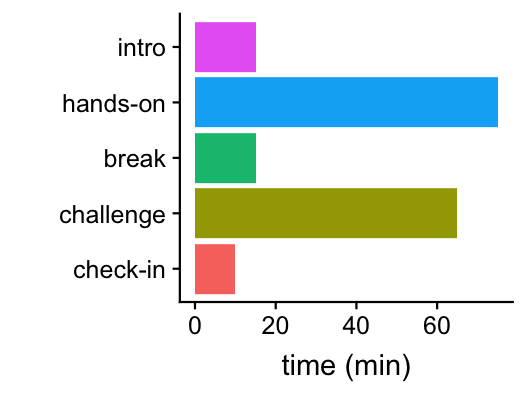
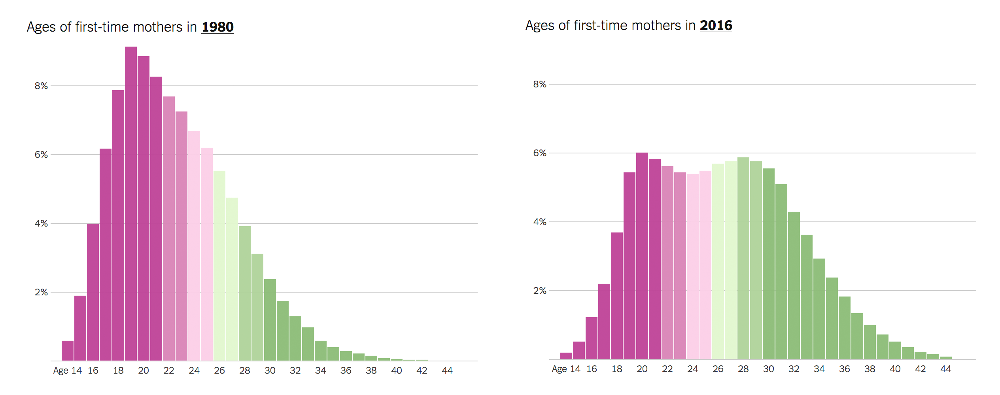
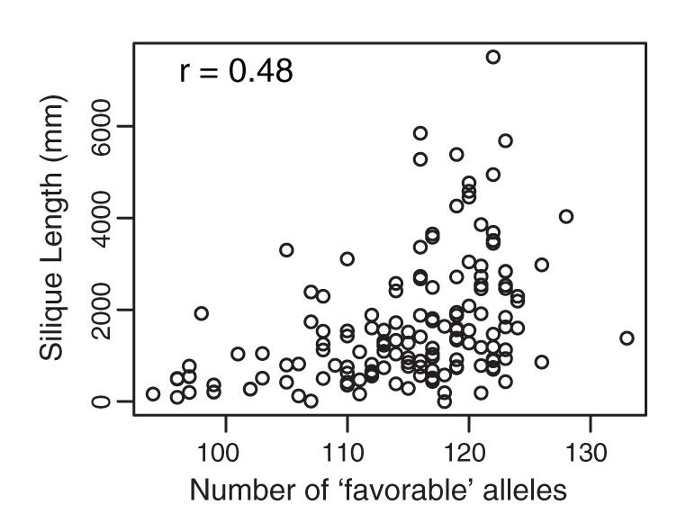
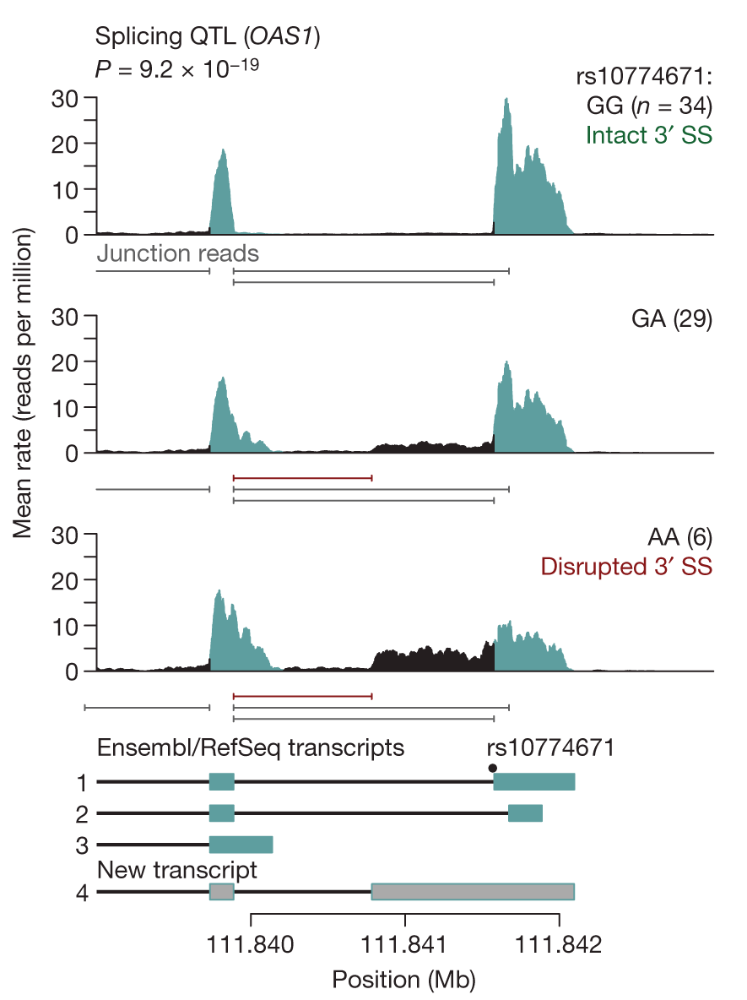
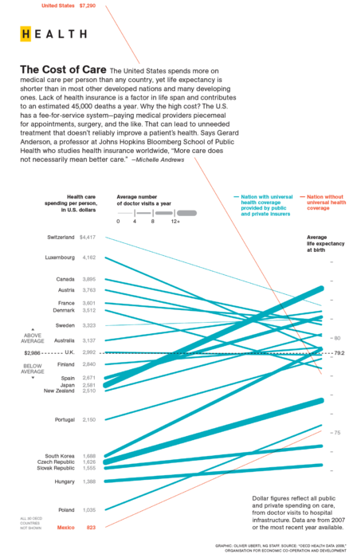
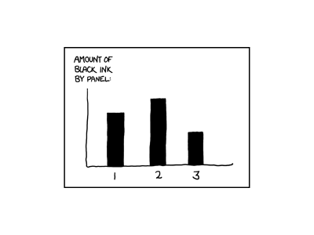

```{r knitr-options, echo=FALSE}
knitr::opts_chunk$set(comment = "#",collapse = TRUE,results = "hide",
                      fig.show = "hide", message = FALSE,warning = FALSE)
```

Tutorial online
===============



Aim: learn how to create effective plots
========================================

"Figures will typically carry the weight of your arguments. They need
to be clear, attractive, and convincing... And yet, there are
surprisingly few resources to teach you how to make compelling data
visualizations." --Claus Wilke

Revised aim: learn how to create plots
======================================

"In my experience, again just as in writing, you don’t develop eye by
reading a book over the weekend. It is a lifelong process..." --Claus
Wilke

Overlap with "Advanced Computing, Part 1"
=========================================

+ Some inevitable overlap.

+ Here we take a more careful look at ggplot2, and data visualization
  strategies in general.

Why plot?
=========

1. To gain insight into your data ("exploratory data visualization").

2. To tell a story (e.g., for a scientific publication).

Both 1 & 2 are usually *iterative* and *repetitive*. Therefore, you
need to develop skills to *efficiently* create & refine plots.

Effective visualizations aren't hard to find
============================================

*New York Times*, Aug. 4, 2018:



Plots need not be complicated to be effective
=============================================

Hancock et al, *Science*, 2011:



Complicated plots can still be *intuitive*
==========================================

Pickrell et al, *Nature*, 2010:



The best plots *tell a story*
=============================



The programmatic approach
=========================

We will take the *programmatic approach* to data visualization, which
will allow us to...

+ Create an endless variety of plots.

+ Expand expand possibilities with R plots.

+ Reuse code to quickly create sophisticated plots---*automation is
  your friend*.

+ **ggplot2** is (currently) the preferred approach to creating plots in R.

The programmatic approach
=========================

The code used to generate the "tutorial outline" slide:

```{r outline-bar-chart}
library(ggplot2)
library(cowplot)
x <- data.frame(part=c("intro","hands-on","break",
                       "challenge","check-in"),
                time=c(15,75,15,65,10))
x <- transform(x,part = factor(part,part[5:1]))
ggplot(x,aes(x = part,y = time,fill = part)) +
  geom_bar(stat = "identity") +
  coord_flip()
```

Tutorial aims
=============

1. Get hands-on experience with the basic elements of data visualization
   in R.

2. Learn how to interpret & build on someone else's R code for creating
   plots using ggplot2.

3. Scrutinize plots, good and bad.

4. Build on some of the skills you learned in the previous tutorials.

5. Learn through "live coding"---this includes learning from our
   mistakes!

The hands-on exercise
=====================

+ We will use someone else's R code to create some plots.

+ To achieve our aims, we will need to make some changes to the code.

+ First, we will slowly step through the code to learn how it works.

It's your choice
================

Your may choose to...

+ Use RStudio on your laptop.

+ Use R on your laptop.

+ Pair up with your neighbour.

+ Follow what I do on the projector.

Initial setup
=============

+ WiFi.

+ Power outlets.

+ Pace & questions (e.g., keyboard shortcuts).

+ Copying-and-pasting from PDF.

+ Reading what I type.

+ Tutorial packet.

+ Locating your team.

+ Help.

Materials for the hands-on exercise
===================================

+ **slides.pdf:** These slides.

+ **slides.Rmd:** R Markdown source used to generate these slides.

+ **handout.pdf**: Tutorial handout.

+ **handout.Rmd:** Markdown source used to generate the tutorial
  handout.

+ **Food_Inspections.csv.gz:** Food Inspection data downloaded
  from the Chicago Data Portal.

+ **pizzaplots.R:** R code used in hands-on exercise.

+ **communitymap_nov2016.pdf:** City of Chicago Police Community Areas Map.

Software we will use in this tutorial
=====================================

1. **R**

2. R packages **ggplot2**, **cowplot** and **readr**.

3. **RStudio** (optional).

Run `sessionInfo()`
===================

Check the version of R that you are using:

```{r check-version}
sessionInfo()
```

Check your R environment
========================

The R environment is where all variables (and functions) are stored and
accessed. You should start with an empty environment. Run this:

```{r check-env}
ls()
```

If this outputs names of objects, it means your environment is not
empty, and you should restart R with a clean environment. Do either:

+ `rm(list = ls())`.

+ Or, in RStudio, **Session > Restart R**.

A test plot
===========

To test that your R environment is properly set up, let's plot some
fuel economy data from the EPA:

```{r first-plot}
library(ggplot2)
mpg <- read.csv("mpg.csv")
ggplot(mpg,aes(displ,cty,color = class)) +
  geom_point()
```

Does it work? Later we will understand what this code does.

Hands-on exercise
=================

1. *Read description from handout.*

2. Open source file, **pizzaplots.R**, in RStudio or your
   favourite editor.

3. Make sure your working directory is the same directory containing
   the tutorial materials; use `getwd()` to check this.

Set up your R environment for the analysis
==========================================

If you haven't already done so, install the packages we will use:

```{r install-pkgs, eval=FALSE}
install.packages("readr")
install.packages("ggplot2")
install.packages("cowplot")
```

Next, load the packages:

```{r load-pkgs}
library(readr)
library(ggplot2)
library(cowplot)
```

Specify the file containing the data to be analyzed:

```{r script-settings}
data.file <- "Food_Inspections.csv.gz"
```

Load the Food Inspection data
=============================

Use `read_csv` from the **readr** package to load the data into a data
frame:

```{r load-data}
dat        <- read_csv(data.file)
class(dat) <- "data.frame"
```

Check that the data were read correctly, and inspect the table:

```{r inspect-data}
nrow(dat)
ncol(dat)
summary(dat)
object.size(dat)
```

Keep some columns, and rename them
==================================

```{r remove-columns}
cols     <- c(2:5,7,8,11,13,15,16)
colnames <- c("dba","aka","license","type",
              "address","city","date",
              "results","latitude","longitude")
dat        <- dat[cols]
names(dat) <- colnames
```

Which assignments *create* objects in your environment, and which
assignments *overwrite* objects?

Extract year from inspection date
=================================

```{r extract-year}
get.third.entry <- function(x) x[3]
out      <- strsplit(dat$date,"/")
dat$year <- sapply(out,get.third.entry)
dat$year <- as.numeric(dat$year)
```

Note that processing dates & times is a complicated topic.

+ *How many inspections were done in each year? Which year saw the
  most inspections?*

Filter out rows
===============

```{r filter-rows} 
dat <- subset(dat,
              type == "Restaurant" &
              city == "CHICAGO" &
              !is.na(latitude) &
              !is.na(longitude) &
              !is.na(license))
```

*How many records satisfy these criteria?*

Extract data on pizza restaurants
=================================

As before, we use `subset` to filter out inspection records. To be
prudent, create a new data frame, "pdat", short for "pizza data":

```{r get-pizza-data}
pdat <- subset(dat,
  grepl("pizz",dba,ignore.case = TRUE) |
  grepl("pizz",aka,ignore.case = TRUE))
```

*How many inspections were done in pizza restaurants?*

Sort rows and keep unique license entries
=========================================

First, sort the rows of the table by year of inspection:

```{r sort-rows-by-year}
rows <- order(pdat$year)
pdat <- pdat[rows,]
```

The idea is that the each "license" should correspond to a restaurant.
After this step, there should be one row per pizza location:

```{r select-unique-licenses}
rows <- which(!duplicated(pdat$license))
pdat <- pdat[rows,]
```

*How many rows to you have in your table after these steps? How would
you double-check that each license appears only once in the table?*

Our first plot: number of new pizza places by year
==================================================

Our first plot is a bar chart of the estimated number of new pizza
restaurants by year. Use `table` to create a table containing number
of newly inspected restaurants by year, skipping the first and last
years:

```{r count-inspections-by-year}
counts <- table(pdat$year)
counts <- counts[2:8]
```

To plot these counts in ggplot2, we need to create a data frame:

```{r convert-counts}
counts <- as.data.frame(counts)
names(counts) <- c("year","count")
```

We now have a data frame with two columns, "year" and "count". *Let's
plot it!*

Our first plot... finally
=========================

Specify the data frame, and the mapping between variables (columns)
and plotting elements:

```{r create-barchart-1}
aes1 <- aes(x = as.numeric(year),y = count)
p1   <- ggplot(counts,aes1)
```

Specify *how* to plot the data points:

```{r create-barchart-2}
out <- geom_col(fill = "darkblue",width = 0.5)
p1  <- ggplot_add(out,p1)
```

Where is the plot?
==================

Variable `p1` is a "ggplot" object. Internally, it is very
complicated, so you don't want to manipulate it directly:

```{r create-barchart-3}
class(p1)
attributes(p1)
```

The `print` function tells R to draw the plot to the screen:

```{r create-barchart-4}
print(p1)
p1
```

*What is the overall trend?*

ggplot2 essentials
==================

All plots in ggplot2 require these three elements:

1. A data frame.

2. An "aesthetic mapping" that declares how columns are mapped to plot
   features (axes, shapes, colors, *etc.*).

3. A "geom", short for “geometric object,” that specifies the type
   of plot.

All plots are created by *adding layers.*

Adjusting the plot
==================

Let's improve the y-axis label:

```{r create-barchart-5}
out <- labs(y = "number of locations")
p1  <- ggplot_add(out,p1)
```

*All plot adjustments are also "layers".*

First challenge
===============

Sometimes lines are more effective than bars for highlighting
trends. If you wanted to show the trend as a line plot, how would you
change the code to do this?

Alternative ggplot2 syntax
==========================

Here is equivalent code that is more concise (and more commonly used),
but also more difficult to understand because it is less clear what
the "+" does:

```{r create-barchart-6}
p1 <- ggplot(counts,aes(x = year,y = count)) +
  geom_col(fill = "darkblue",width = 0.5) +
  labs(y = "number of locations")
```

*I recommend using the less concise syntax until you are more
comfortable with ggplot2.*

Our second plot
===============

The second plot is far more interesting, and no less difficult to
create *now that we have carefully prepared the data*. First, we
specify the data frame, the mapping, and what to plot:

```{r create-map-1}
aes2 <- aes(x   = longitude,
            y   = latitude,
            col = year)
p2   <- ggplot(pdat,aes2)
out  <- geom_point(pch = 20)
p2   <- ggplot_add(out,p2)
```

*Compare to the Chicago community map provided in the tutorial
packet. What geographic features of Chicago are recognizable from
this plot?*

Adjusting the colour mapping
============================

This code chunk adjusts the way that the years are mapped to colours:

```{r create-map-2}
out <- scale_color_gradient2(low = "skyblue",
         mid = "white",high = "orangered",
		 midpoint = 2014)
p2  <- ggplot_add(out,p2)
```

All functions starting with `scale_` modify the behaviour of the
geoms.

+ *Based on the plot output, what do the `scale_color_gradient2`
  arguments do?

+ *Why do these colours work better than before?*

Combining the plots
===================

With cowplot, this is easily done:

```{r combine-plots}
p12 <- plot_grid(p1,p2,labels = c("A","B"))
```

In **pizzaplots.R**, the `theme_cowplot` function is used to adjust
the size of the text.

Save your plot
==============

PNG is a commonly used format to share images.

```{r save-plot}
ggsave("plots.png",p12,dpi = 150)
```

Re: plots for report
====================

```
I was able to generate the plots using the
R code. Please see attached. Are these the
plots you were expecting for the paper?
```

Re: plots for report
====================

```
Great work, and quick turnaround. These
plots look fantastic. However, I would like
a couple changes to better present the
story I would like to tell: (1) Color
the bars so that they match the colors
in the map; (2) Label Marie's and Nella's
pizzerias on the map. I want to highlight
these in the report to illustrate two
contrasting economic trends. Also, a PNG
won't work for the report. Please send me
a PDF instead. Thanks.
```

Automating plot creation
========================

Instead of stepping through the code line by line, we can run all the
code at once, which should automate all the steps of the analysis and
plotting:

```{r automate-plots, eval=FALSE}
source("pizzaplots.R")
```

In RStudio, there are buttons to do the same thing.

Add the labels, first attempt
=============================

The same code as before, but with a "label" mapping:

```{r add-labels-to-map-1}
aes2 <- aes(x = longitude,y = latitude,
            col = year,label = dba)
p2  <- ggplot(pdat,aes2)
out <- geom_point(pch = 20)
p2  <- ggplot_add(out,p2)
out <- scale_color_gradient2(low = "skyblue",
         mid = "white",high = "orangered",
		 midpoint = 2014)
p2  <- ggplot_add(out,p2)
```

Next, we add a *text* layer:

```{r add-labels-to-map-2}
out <- geom_text()
p2  <- ggplot_add(out,p2)
```

Add labels, second attempt
==========================

Clearly, showing *all* restaurant names won't work. So let's create a
new "label" column in the data frame that is blank except for
the Nella's & Marie's locations:

```{r add-labels-to-map-3}
rows1<-grepl("nella",pdat$dba,ignore.case=TRUE)
rows2<-grepl("marie",pdat$dba,ignore.case=TRUE)
pdat$label <- ""
pdat[rows1,"label"] <- "Nella's"
pdat[rows2,"label"] <- "Marie's"
```

Add labels, second attempt
==========================

Now we can use the new "label" column. Let's also make a few
adjustments so that the text is easier to read on the map.

```{r add-labels-to-map-4}
aes2 <- aes(x = longitude,y = latitude,
            col = year,label = label)
p2  <- ggplot(pdat,aes2)
p2  <- ggplot_add(geom_point(pch = 20),p2)
out <- scale_color_gradient2(low = "skyblue",
         mid = "white",high = "orangered",
		 midpoint = 2014)
p2  <- ggplot_add(out,p2)
out <- geom_text(color = "black",hjust = "right",
                 size = 2.5)
p2  <- ggplot_add(out,p2)
```

This looks good, so let's add our code to **pizzaplots.R** in case we
need to make improvements later.

Second challenge
================

Other improvements are left as a programming
challenge---see the handout:

1. Add color to the bar chart.

2. Save the combined plot as a PDF.

Some take-home points
=====================

+ Preparing data is tedious. Data preparation is sometimes >90% of the
  effort! *Many analysis mistakes are due to poor data preparation.*

+ Creating sophisticated plots using ggplot2 requires relatively
  little effort *provided the data are in the right form.*

+ We illustrated some of the benefits of the *programmatic approach*.

+ All plots in ggplot2 have these three elements:

    1. A data frame.

    2. An "aesthetic mapping" that declares how columns in the data
       frame are mapped to plotting features (axes, shapes, colors,
       *etc.*).

    3. A "geom", short for “geometric object,” that specifies the type
       of plot.

+ Plots are created by combining "layers" using `ggplot_add` or the +
  operator.

Some Best Practices we illustrated
==================================

1. Record your analysis and plotting steps in a file so you can
   reproduce them later.

2. Take advantage of great packages! (Ask others what packages they use.)

3. Use pixel formats (e.g., GIF, PNG, JPEG) for exploratory work, and
   vector formats (e.g., EPS, PDF) for publication-ready figures.

An xkcd bar chart
=================

From http://xkcd.com/688:



Main programming challenge
==========================

+ Gain insight into biological data using simple visualizations.

+ The data: behavioral tests, physiological trait measurements, and
  genotypes from an outbred mouse population.

+ Study aim: understand the genetic contributions to behaviour and
  musculoskeletal traits in mice.

Data used in programming challenge
==================================

+ **pheno.csv:** Various traits measured in 1,219 CFW mice. We will
  explore a few of the columns in this table.

+ **hmdp.csv:** BMD measurements taken in 878 HMDP mice. Used to
  compare against BMD in CFW mice.

+ **gwscan.csv:** Results of a genome-wide scan for abnormal BMD.

+ **geno_rs29477109.csv:** Genotypes at one SNP in 1,038 CFW mice.

Overview of main programming challenge
======================================

+ **Part A:** You will use plots to explore features of the data, and
  relationships between different types of data.

+ **Part B:** You will use plots to learn about bone-mineral density
  in the mouse population.

+ **Part C:** You will use plots to summarize the results of a
  genome-wide association study of BMD, identify possible genetic
  determinants of BMD, and examine closely the relationship between
  genotype and BMD.
