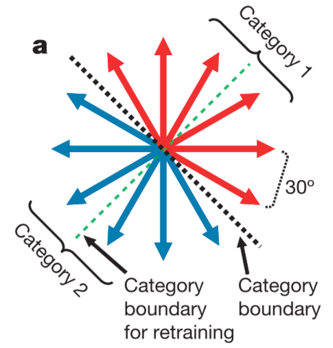
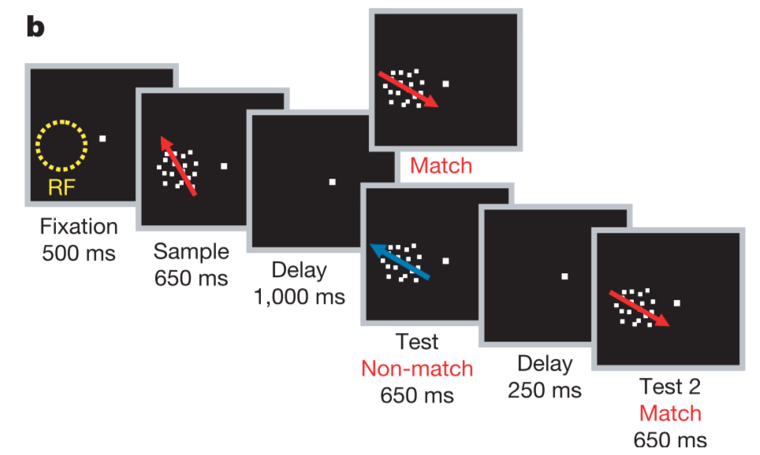
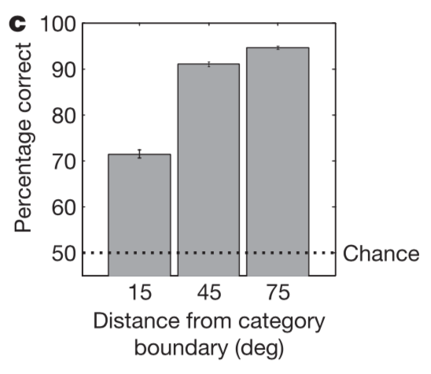
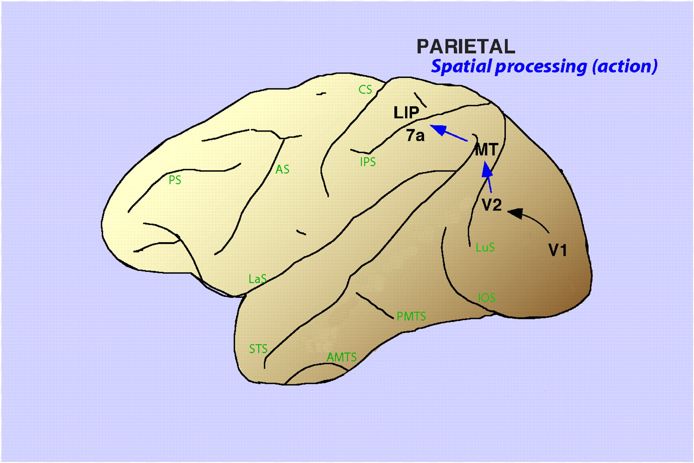

```{r setup, include=FALSE}
knitr::opts_chunk$set(echo = TRUE)
```

### Welcome
This exercise will demonstrate a simple computation performed by neurons in two different brain regions in the brain of the Rhesus macaque. It will illustrate how information is transformed when moving from sensory representations -- in this case, motion direction -- to more abstract representations -- in this case, an arbitrary category of motion direction. 

### The scenario
To solve complex tasks, the brain must often interpret continuous sensory stimuli according to some non-physical or abstract discrete category membership. Thus, both quantities (a sensory and a categorical representation) are likely to be represented in the brain. 

Here, we will investigate one such transform and evaluate data from both sides of this transformation in the domain of visual motion. 

### The task
To investigate how visual information is transformed from a (roughly) continuous representation to a discrete, categorical representation, we need a task that relies on that transformation. 

Here, we'll use data originally published in Freedman and Assad (2006) *Nature*, in which they train two Rhesus macaques to categorize a visual motion stimulus according to an arbitrary category boundary, as here:

```{r category, echo=FALSE, fig.cap="A schematic of the category boundaries (both original and retrained) used in the delayed match-to-category (DMC) task, see below. Taken from Freedman and Assad (2006).", out.width="25%"}

```

The motion stimulus is a patch of 100% coherent (ie, all moving in the same direction) randomly placed moving dots. 

In particular, the animals are performing a delayed match-to-category (DMC) task with the following structure: 

1. They fixate in the center of a computer screen.  
2. A motion stimulus in one of the 12 directions, the sample, is played.  
3. There is a delay period of 1 second.  
4. A second motion stimulus, the test, is played. If its category is the same as the first motion stimulus, the animal must release a lever -- otherwise, they continue to hold the lever. If the lever release is correct, they receive a juice reward.
5. If the animal was supposed to continue holding the lever, there is a second delay followed by a third stimulus which always matches the category of the first stimulus -- the animal must then release the lever to receive juice.  

We will focus primarily on step 2 of the task. The schematic below may make it more clear:

```{r task, echo=FALSE, fig.cap="A schematic of the task described above. The stimuli are 100% coherent dot motion and RF means the receptive field of a recorded neuron (see below). Taken from Freedman and Assad (2006).", out.width="80%"}

```

Even though this task seems fairly complicated, the animals can do it with extensive training -- and their errors follow the pattern one might expect: They make more errors when performing categorizations that are close to the category boundary, but perform well-above chance at all distances from the boundary. 

```{r bhv, echo=FALSE, fig.cap="The average performance of the two animals on the DMC. Taken from Freedman and Assad (2006).", out.width="25%"}

```

So, we have our task that gets at (or, at least, requires) the process that we are interested in. But, now, how do we study this in the brain? Or, perhaps more immediately, *where* do we study it in the brain?

### The brain regions of interest
The middle temporal area (MT) is believed to be the first cortical area with robust representations of visual motion, and has been shown (more recently than the data we are looking at) to be necessary to a similar task using visual motion stimuli. However, MT is thought to provide a more sensory (or literal) representation of motion direction, rather than representing more abstract category membership. MT is also part of the canonical dorsal visual stream, which is thought to primarily underly the allocation of visual attention and spatial processing. 

Next from MT in the dorsal stream hierarchy is posterior parietal cortex (PPC) a complex of regions including the lateral intraparietal area (LIP). 

```{r anatomy, echo=FALSE, fig.cap="A schematic of the canonical dorsal visual stream overlaid on the Rhesus macaque brain. Adapted from Sereno & Lehky (2007).", out.width="50%"}

```

How does representation of visual motion while an animal is performing our categorization task differ between MT and LIP? What are some hypotheses that one could test? 

### Spiking: the substrate of neural communication
Neurons in the brain are believed to communicate through the firing of action potentials and consequent release of neurotransmitters, commonly called spiking. One of the problems of neuroscience is gaining access to this spiking activity with the appropriate level of granularity for our questions. 

In the literature on non-human primates (NHPs) including Rhesus macaques, one of the most common techniques is called extracellular electrophysiology, which can be performed in awake and behaving animals. With this technique, an experimentalist is able to record single spikes from single neurons in an anatomically (and sometimes functionally) defined region of the brain. While techniques exist now for recording modestly sized groups of neurons, the dataset we are using today is from 2006, so all of the single neurons we will look at were recorded in separate sessions -- independently of one another. As one might guess, then, sometimes these experiments can take awhile. 

This technique has high temporal resolution (ie, we are recording single spikes) and high spatial resolution (ie, we are recording from single cells), but relatively poor spatial and temporal extent (ie, we can typically record spikes from a single neuron for only a couple hours and we have limited information about what other, nearby cells are doing). So, it is a good technique for studying how stimuli are represented at the neuron level in particular brain regions, and therefore a good technique for studying the neural code -- however, it is not a good technique for looking at large-scale neuronal activity or neural dynamics within and across areas. 

So, we recorded a bunch of spikes from a bunch of neurons in both MT and LIP. And we want to understand how their representations of visual motion direction and (potentially) visual motion category differ. Let's get started! 

### The spiking of an MT neuron
First, we need to load our dataset, which is in the MatLab format (for which we can use the library "rmatio" -- which should be installed on your machine): 
```{r load}
library(rmatio)

mt_neuron_folder <- '../data/MT/'
mt_neuron_path <- '../data/MT/dseao01.mat'

mt_neuron <- read.mat(mt_neuron_path)
```
Now, what's happening in this data structure?
```{r mt_summary}
str(mt_neuron)
```

This is read into R as a named list, which is not the most convenient format, but we can use it, and we can see that:

- Everything is nested inside one list. 
- The inner list has three elements: 
    - **trial_raster:** A list of one element, where that element is an array of dimensions 246 and 2700. This is the spike "raster" for our MT neuron. There are 246 trials and each trial is segmented into 2700 bins, each 1 ms in size. The value of each bin is 0 if no spike was recorded from this neuron at that time point, and 1 if a spike was recorded. 
  The visual motion stimulus appears 500 ms into the trial, at element 500. 
    - **samp_direction_this_trial:** This is the direction in degrees of the first visual motion stimulus. Since MT neurons are thought to be tuned to visual motion, we might expect them to vary their responses with changes in direction. 
    - **test_direction_this_trial:** We will largely ignore this here, but it is the direction of the second visual motion stimulus.
    
So, let's analyze this:

**Q:** How should we visualize spiking information?  
**A:** A raster plot.

```{r raster_plot}

library(ggplot2)

stim_onset = 500

mt_raster <- mt_neuron[['trial_raster']]

# where are there spikes?
spkpairs = which(mt_raster == 1, arr.ind=TRUE)
qplot(spkpairs[ , 2] - stim_onset, spkpairs[ , 1], 
      xlab='time from stimulus onset (ms)',
      ylab='trial')

```

This is hard to make sense of. It seems like we get a response to the first stimulus, relatively less firing during the delay period, followed by a strong response to the second stimulus. But is this neuron tuned to anything in particular? In particular, we would expect it to represent motion direction... so, let's sort this raster by motion direction!

```{r sorted_raster}

dirs = mt_neuron[['samp_direction_this_trial']]
sort_dirs = sort(dirs, index.return=TRUE)
order_inds = sort_dirs$ix
s_dirs = sort_dirs$x

ordered_raster = mt_raster[order_inds, ]
sorted_spkpairs = which(ordered_raster == 1, arr.ind=TRUE)

dfact = factor(s_dirs[sorted_spkpairs[, 1]], levels=unique(s_dirs))

qplot(sorted_spkpairs[ , 2] - stim_onset, sorted_spkpairs[ , 1], 
      color=dfact, xlab='time from stimulus onset (ms)',
      ylab='trial') +
  labs(color='motion direction (degrees)')

```

Yes! This neuron appears to be strongly tuned to motion around 210 and 240 degrees. But this does not really give us a full picture... 

**Q:** How can we summarize multiple trials of spikes?   
**A:** The peri-event time histogram, or the average number of spikes in each time bin. 

```{r psth}

unique_dirs <- unique(dirs)
xs <- 1:2700 - stim_onset
filter_size <- 51
conversion <- 1000

raster_ts = ts(t(ordered_raster), xs[1], xs[length(xs)], 
               frequency=1)

# for a boxcar filter
filter <- rep(1/filter_size, filter_size)
smooth_raster <- stats::filter(raster_ts, filter)*conversion

mean_arr <- array(dim=c(length(unique_dirs), length(xs)))
for (i in 1:length(unique_dirs)) {
  d <- unique_dirs[i]
  dir_raster <- smooth_raster[ , s_dirs == d]
  mean_arr[i, ] <- apply(dir_raster, 1, mean)
}

flat_means <- as.vector(t(mean_arr))
d = data.frame(ts=rep(xs, length(unique_dirs)),
               dir=rep(unique_dirs, length(unique_dirs), 
                       each=length(xs)),
               spk_rates=flat_means)

ggplot(d, aes(x=ts, y=spk_rates, color=factor(dir))) +
  geom_line(aes(group=factor(dir)), size=1) +
  labs(x='time from stimulus onset (ms)', y='spks/s', 
       color='motion direction (degrees)')
```

*We can explore different sizes of smoothing windows, too -- how much smoothing is appropriate? What do we lose by using more smoothing? What do we gain?*

**Q:** How can we summarize a stimulus response?  
**A:** If we believe that stimulus information is conveyed by the rate of spiking, then examining only the average count of spikes in the stimulus response window will be sufficient. 

```{r spk_count}

count_start <- 100
count_end <- 600
count_filter <- (xs >= count_start) & (xs < count_end)
conversion <- 1000/(count_end - count_start)

spk_counts <- apply(raster_ts[count_filter, ], 2, sum)*conversion

sorted_udirs <- sort(unique_dirs)
cts = array(dim=c(length(unique_dirs)))
for (i in 1:length(cts)) {
  cts[i] = mean(spk_counts[sorted_udirs[i] == s_dirs])
}

d <- data.frame(spk_cts=cts, dirs=sorted_udirs)
ggplot(d, aes(x=dirs, y=spk_cts)) +
  geom_line() +
  labs(x='motion direction (degrees)', y='spks/s')
```

Cool! This neuron has strongly peaked responsiveness for a particular motion direction. 

*Experiment with different spike counting windows (ie, change count_start and count_end), and view how this changes! (Also look at this later, for LIP neurons as well.)*

**Q:** How does this selectivity line up with our category boundaries?  
**A:** Category 1 runs from 135 to 315 degrees, so we can shift our data (slightly) to make 135 degrees in the center of the x-axis. 

```{r shifted_rates}

# let's define our first function
# taken from https://stackoverflow.com/questions/30542128
# /circular-shifting-arrays-in-r-by-distance-n

category_bound <- 135
bound_dists <- abs(sorted_udirs - category_bound)
mindist <- min(bound_dists)
first_min <- which(mindist == bound_dists)[1]
target <- length(sorted_udirs)/2
steps <- first_min - target

## we could give them this (why doesn't R have one in the default
## library?!)
circular_shift <- function(vec, steps) {
  if (steps == 0) vec else c(tail(vec, -steps), head(vec, steps))
}

shift_udirs <- circular_shift(sorted_udirs, steps)
shift_cts <- circular_shift(cts, steps)
dummy_x = 1:length(shift_udirs)

d <- data.frame(dirs=shift_udirs, cts=shift_cts, xs=dummy_x)
ggplot(d, aes(x=dummy_x, y=shift_cts)) + 
  geom_line() +
  labs(x='motion direction (degrees)', y='spks/s') +
  geom_vline(aes(xintercept=(length(dummy_x) + 1)/2),
             linetype="dashed", size=1) +
  scale_x_continuous(breaks=dummy_x, 
                     labels=as.character(shift_udirs))
```

This neuron does seem to also respond preferentially to a particular category, though its response is heteregeneous within that category... we will come back to this later. 

First, let's make things easy on ourselves: Let's write a function to take in a datafile of the format we've been dealing with and process the data to produce this plot. Then, we can easily look at other MT cells -- and some LIP cells. 

```{r functions}

read_neuron <- function(filename) {
  neuron <- read.mat(filename)
  name <- tail(strsplit(filename, '/')[[1]], n=1)
  xs = 1:dim(neuron[['trial_raster']])[2]
  dirs <- neuron[['samp_direction_this_trial']]
  sort_dirs <- sort(dirs, index.return=TRUE)
  order_inds <- sort_dirs$ix
  dirs <- sort_dirs$x
  udirs <- sort(unique(dirs))
  raw_spks <- neuron[['trial_raster']]
  spks <- ts(t(raw_spks[order_inds, ]), xs[1], xs[length(xs)], 
             frequency=1)
  neur <- list(name=name, dirs=dirs, udirs=udirs, spks=spks)
  neur
}

direction_spkcounts <- function(spks, udirs, dirs, count_beg, 
                                count_end) {
  xs <- 1:dim(spks)[1]
  count_filter <- (xs >= count_beg) & (xs < count_end)
  conversion = 1000/(count_end - count_beg)
  spk_counts <- apply(spks[count_filter, ], 2, sum)*conversion
  cts = array(dim=c(length(udirs)))
  for (i in 1:length(cts)) {
    cts[i] = mean(spk_counts[udirs[i] == dirs])
  }
  cts
}

plot_direction_tuning <- function(cts, sorted_udirs, category_bound,
                                  neuron_name) {
  # now for the shifting we did earlier
  bound_dists <- abs(sorted_udirs - category_bound)
  mindist <- min(bound_dists)
  first_min <- which(mindist == bound_dists)[1]
  target <- length(sorted_udirs)/2
  steps <- first_min - target
  shift_udirs <- circular_shift(sorted_udirs, steps)
  shift_cts <- circular_shift(cts, steps)
  dummy_x <- 1:length(shift_udirs)
  d <- data.frame(dirs=shift_udirs, cts=shift_cts, xs=dummy_x)
  fig <- ggplot(d, aes(x=dummy_x, y=shift_cts)) + 
    geom_line() +
    labs(x='motion direction (degrees)', y='spks/s') +
    geom_vline(aes(xintercept=(length(dummy_x) + 1)/2),
               linetype="dashed", size=1) +
    scale_x_continuous(breaks=dummy_x, 
                       labels=as.character(shift_udirs))
  fig
}

get_direction_tuning <- function(filename, count_beg, count_end, 
                                 category_bound) {
  n <- read_neuron(filename)
  cts <- direction_spkcounts(n[['spks']], n[['udirs']], n[['dirs']],
                             count_beg, count_end)
  plot_direction_tuning(cts, n[['udirs']], category_bound, n[['name']])
}

# let's check it works with our original neuron
get_direction_tuning(mt_neuron_path, count_start + stim_onset, 
                     count_end + stim_onset, category_bound)
```

Okay, now let's try an LIP neuron. 

```{r lip_neuron}
lip_neuron_folder <- '../data/LIP/'
lip_neuron_name <- 'dhbbf03.mat'
lip_neuron_path <- paste(lip_neuron_folder, lip_neuron_name, 
                         sep='')

## as a note, the really striking LIP category tuning (as shown 
## in the paper) happens during the delay period -- but, there's
## very little interesting activity in MT during the delay period
get_direction_tuning(lip_neuron_path, count_start + stim_onset, 
                     count_end + stim_onset, category_bound)
```

This looks at least slightly more... categorical. But, let's look at more neurons from LIP and from MT. 

Now, let's plot a bunch of neurons from LIP:

```{r lip_pop}
lip_neuron_names <- list.files(lip_neuron_folder)

## take a random subset from MT too!
plots <- 5
lip_samp <- sample(lip_neuron_names, plots)
for (n in lip_samp) {
  neur_path <- paste(lip_neuron_folder, n, sep='')
  f <- get_direction_tuning(neur_path, count_start + stim_onset, 
                            count_end + stim_onset, category_bound)
  print(f)
}
```

And now from MT! 
```{r mt_pop}
mt_neuron_names <- list.files(mt_neuron_folder)

## take a random subset from MT too!
plots <- 5
lip_samp <- sample(mt_neuron_names, plots)
for (n in lip_samp) {
  neur_path <- paste(mt_neuron_folder, n, sep='')
  f <- get_direction_tuning(neur_path, count_start + stim_onset, 
                            count_end + stim_onset, category_bound)
  print(f)
}
```

Okay, it's difficult to make sense of all of these plots. Some plots from MT and LIP look similar -- others look different! We need to find a way to summarize the category and direction tuning of each. 

**Q:** Why is it difficult to tease apart category and direction selectivity? 
**A:** Because they're correlated in the experimental design. 

In the paper, the authors develop a measure of within-category difference (WCD; how much heterogeneity in response does a neuron have for members of the same category?) as well as a between-category difference (BCD; how much heterogeneity is there across categories?). Using both of these, to construct a single index, written as: 
$$
CI = \frac{BCD - WCD}{WCD + BCD}
$$
which ranges from $[-1, 1]$ with positive values indicating a neuron is more modulated by changes in motion direction across the category boundary than by changes in motion direction within a category -- thus, more categorically tuned.

Looking at this index across our MT and LIP populations will tell us whether they tend to represent the categories particularly or direction uniformly. 

Let's implement that here:

```{r wcd_bcd}

ensure_angle <- function(ang) {
  ang <- ang %% 360
  ang[ang < 0] <- ang[ang < 0] + 360
  ang[ang == 360] <- 0
  ang
}

ang_dist <- function(ang1, ang2) {
  d1 <- ensure_angle(ang1 - ang2)
  d2 <- ensure_angle(ang2 - ang1)
  d <- min(c(d1, d2))
  d
}

## definitely we should give them this function, it was sort of
## annoying to write
get_pairs <- function(reference, udirs, dist) {
  gap <- mean(diff(sort(udirs)))
  z <- dist/gap
  c1 <- ensure_angle(udirs - reference) >= 0
  c2 <- ensure_angle(udirs - reference - 90) < 0
  ac <- c1 & c2
  if (z %% 2 == 1) {
    left <- ensure_angle(reference - dist/2)
    right <- ensure_angle(reference + dist/2)
  } else {
    l1 <- ensure_angle(reference - dist/3)
    r1 <- ensure_angle(reference + 2*dist/3)
    adj1 <- udirs - l1
    adj1 <- adj1[which.min(abs(adj1))]
    l1 <- ensure_angle(l1 + adj1)
    r1 <- ensure_angle(r1 + adj1)
    l2 <- ensure_angle(reference - 2*dist/3)
    r2 <- ensure_angle(reference + dist/3)
    adj2 <- udirs - l2
    adj2 <- adj2[which.min(abs(adj2))]
    l2 <- ensure_angle(l2 + adj2)
    r2 <- ensure_angle(r2 + adj2)
    left <- c(l1, l2)
    right <- c(r1, r2)
  }
  x <- list(left=left, right=right)
  x
}

## we could potentially give them this one too
take_count_diff <- function(cts, udirs, comp_dirs) {
  n_pairs <- length(comp_dirs[['left']])
  ds <- array(dim=n_pairs)
  for (i in 1:n_pairs) {
    l <- comp_dirs[['left']][i]
    r <- comp_dirs[['right']][i]
    ds[i] <- abs(cts[l == udirs] - cts[r == udirs])
  }
  absdiff <- mean(ds)
  absdiff
}

avg_oriented_diff <- function(cts, udirs, dir_cent) {
  gap <- mean(diff(sort(udirs)))
  spacings <- seq(gap, 180 - gap, by=gap)
  diff_avgs <- array(dim=c(length(spacings)))
  for (i in 1:length(diff_avgs)) {
    spacing <- spacings[[i]]
    d1 <- get_pairs(dir_cent, udirs, spacing)
    diff1 <- take_count_diff(cts, udirs, d1)
    d2 <- get_pairs(ensure_angle(dir_cent + 180), udirs, spacing)
    diff2 <- take_count_diff(cts, udirs, d2)
    diff_avgs[i] <- mean(c(diff1, diff2))
  }
  mean(diff_avgs)
}

bcd <- function(cts, udirs, category_bound) {
  avg_oriented_diff(cts, udirs, category_bound)
}

wcd <- function(cts, udirs, category_bound) {
  avg_oriented_diff(cts, udirs, ensure_angle(category_bound + 90))
}

category_index <- function(cts, udirs, category_bound) {
  n_bcd <- bcd(cts, udirs, category_bound)
  n_wcd <- wcd(cts, udirs, category_bound)
  (n_bcd - n_wcd)/(n_bcd + n_wcd)
}

get_category_index <- function(path, category_bound, count_beg,
                               count_end) {
  neur <- read_neuron(path)
  cts <- direction_spkcounts(neur[['spks']], neur[['udirs']], 
                             neur[['dirs']], count_beg, count_end)
  category_index(cts, neur[['udirs']], category_bound)
}

get_ci_dist <- function(folder, category_bound, count_beg, count_end) {
  names <- list.files(folder)
  ci_dist <- array(dim=c(length(names)))
  for (i in 1:length(names)) {
    n <- names[[i]]
    neur_path <- paste(folder, n, sep='')
    ci_dist[i] <- get_category_index(neur_path, category_bound, 
                                     count_beg, count_end)
  }
  ci_dist
}

get_category_index(lip_neuron_path, category_bound, 
                   count_start + stim_onset, count_end + stim_onset)
```

Okay, this seems to work: now, let's compute the distribution of category indices for our MT and LIP populations. 

```{r index_distrib}
lip_ci <- get_ci_dist(lip_neuron_folder, category_bound, 
                      count_start + stim_onset, count_end + stim_onset)

mt_ci <- get_ci_dist(mt_neuron_folder, category_bound,
                     count_start + stim_onset, count_end + stim_onset)

```

Now, let's look at the results:

```{r distrib_results}

library(plyr)

d <- data.frame(region=factor(c(rep("LIP", length(lip_ci)),
                                rep("MT", length(mt_ci)))),
                ci=c(lip_ci, mt_ci))

mean_dat <- ddply(d, "region", summarise, ci.mean=mean(ci))

ggplot(d, aes(x=ci, fill=region)) +
  geom_histogram(binwidth=.125, alpha=.5, position="identity") +
  geom_vline(data=mean_dat, aes(xintercept=ci.mean, colour=region),
             linetype="dashed", size=1) +
  xlab('category tuning index') +
  ylab('number of neurons')

```


So, it looks like LIP does have a significant bias toward category tuning. But let's test that: 

```{r stats}

str(c('LIP, p-value ', t.test(lip_ci)$p.value))
str(c('MT, p-value ', t.test(mt_ci)$p.value))
```

Let's publish this in Nature! 

But, wait, what if our category boundary just happened to reflect some innate bias in LIP direction representations? That would be weird, but it's not impossible. Let's retrain the animals on a new category boundary and then check that (a) we no longer have significant category tuning for the old categories and (b) we do have significant category tuning for the new boundary. 

```{r new_boundary}
lip2_neuron_folder <- '../data/LIP2/'
category_bound2 <- ensure_angle(category_bound + 90)

lip2_ci_perp <- get_ci_dist(lip2_neuron_folder, category_bound, 
                            count_start + stim_onset, 
                            count_end + stim_onset)

lip2_ci_cong <- get_ci_dist(lip2_neuron_folder, category_bound2, 
                            count_start + stim_onset, 
                            count_end + stim_onset)


```

These distributions are, by definition, negatives of each other -- but we can plot them anyway just to see:

```{r new_bound_stats}

d <- data.frame(region=factor(c(rep("LIP2 perp", length(lip2_ci_perp)),
                                rep("LIP2 cong", length(lip2_ci_cong)))),
                ci=c(lip2_ci_perp, lip2_ci_cong))

mean_dat <- ddply(d, "region", summarise, ci.mean=mean(ci))

ggplot(d, aes(x=ci, fill=region)) +
  geom_histogram(binwidth=.125, alpha=.5, position="identity") +
  geom_vline(data=mean_dat, aes(xintercept=ci.mean, colour=region),
             linetype="dashed", size=1) +
  xlab('category tuning index') +
  ylab('number of neurons')


str(c('LIP original bound, p-value ', t.test(lip2_ci_perp)$p.value))
str(c('LIP new bound, p-value ', t.test(lip2_ci_cong)$p.value))
```

Significant category tuning for the new boundary, and (of course) significant tuning against the old boundary! LIP really does appear to be learning and robustly representing these arbitrary motion direction boundaries. 

This is one step in the processing of a "raw" sensory representation into the kind of categorical representation that we all use for making decisions! 

## one thing we could easily add if this is too short is constructing a null distribution of gaussian tuned neurons to see what a uniform tiling of direction space would produce for a CI distribution